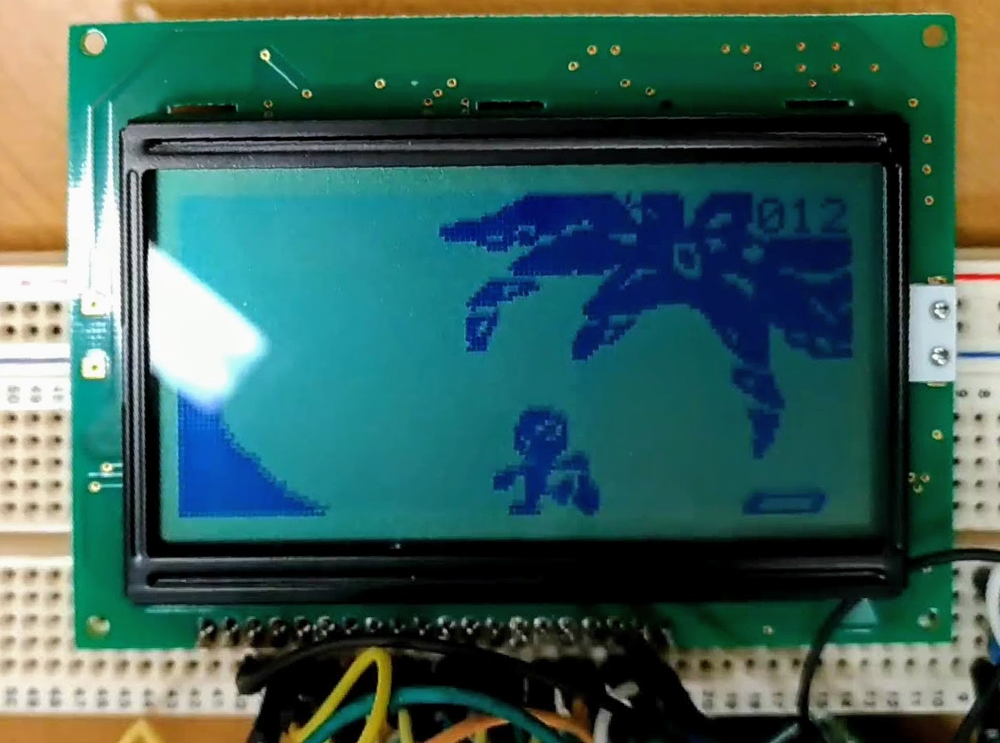
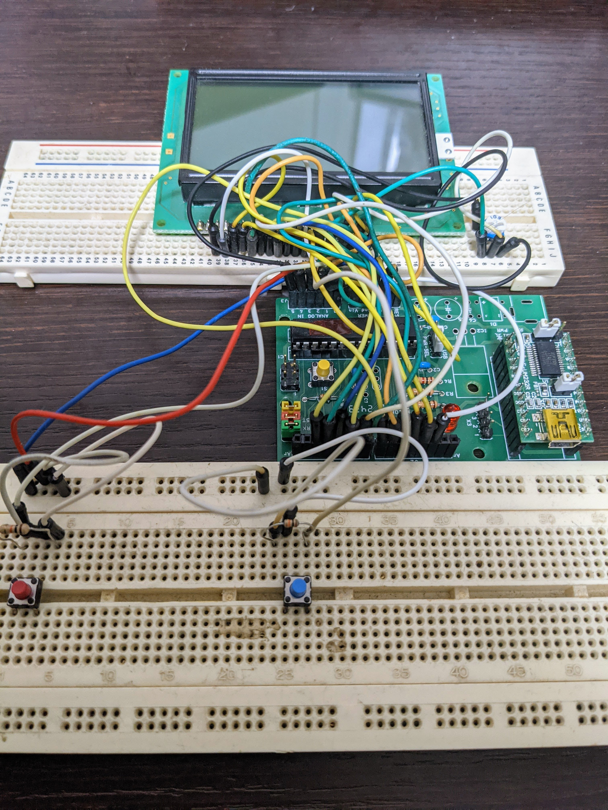
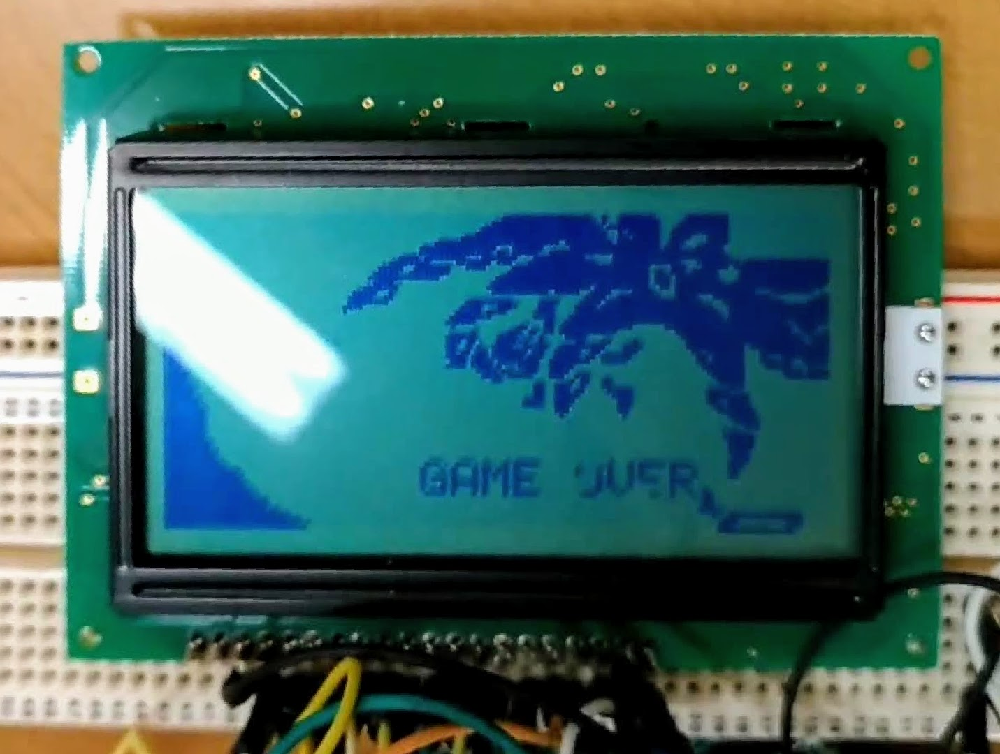

# オクトパス

ゲームウォッチの『オクトパス』を模したゲームです。
学部1年の秋（2017年11月）に作成し、学園祭で発表しました。
同期と二人で作成しました。

画面サイズ$128 \times 64$のモノクロ液晶ディスプレイ（SG12864ASLB-GB）にオクトパスを再現しました。
ディスプレイへの画像出力はArduino互換基盤（AE-ATmega）から行っています。
左右への移動は、それぞれ基盤のアナログ2ピン、3ピンにHIGHを入力することで（多分）行なえます。

動作映像（YouTube）: <https://youtu.be/j8sFqUiPSCk>

ドットフォント（`src/Font.h`）は[きむ茶工房ガレージハウス](http://zattouka.net/GarageHouse/micon/Arduino/GLCD/GLCD.htm)様よりお借りしました。

## 写真

### 外観

### プレイ中

### ゲームオーバー

### その他

- ミクさん: [img/miku-san.jpg](https://github.com/crossr0ad/Octopus/blob/main/img/miku-san.jpg)
- 文字表示: [img/string.jpg](https://github.com/crossr0ad/Octopus/blob/main/img/string.jpg)

## FAQ

### なぜブレッドボード上に実装しているの？

作成時点では、4ボタンやカートリッジ式でのゲーム交換など将来の仕様変更を前提としていたからです。
しかし学園祭直後、バディ（）が突然部室に来なくなったため、その計画は頓挫しました。

### コードが汚いです

C言語を学習したての学部1年の時分に作成したため、慣れていなかったためです。
これからリファクタリングする予定です。

## 参考リンク

- LCDの仕様書（秋月電子）: [SG12864ASLB-GB](https://akizukidenshi.com/download/ds/sunlike/SG12864ASLB-GB-G.pdf)
- Arduino（互換）基盤の回路図（秋月電子）: [AE-ATmega](https://akizukidenshi.com/download/atmega-board-sch.pdf)
- [Arduino 日本語リファレンス](http://www.musashinodenpa.com/arduino/ref/index.php)
